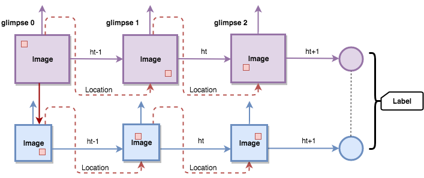
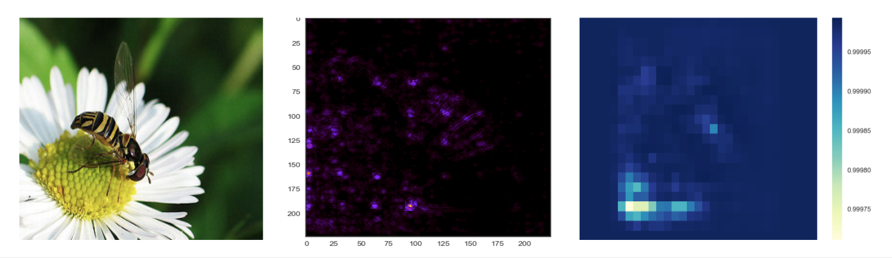

# Vision-Mask-and-Attend

We explore Visual Recognition Process through two perspectives: **Masking** and **Attention**.

## Visual Attention - [Implementation](recurrent-visual-attention)

## Visual Occlusion - [Implementation](deep-visual-occlusion)

