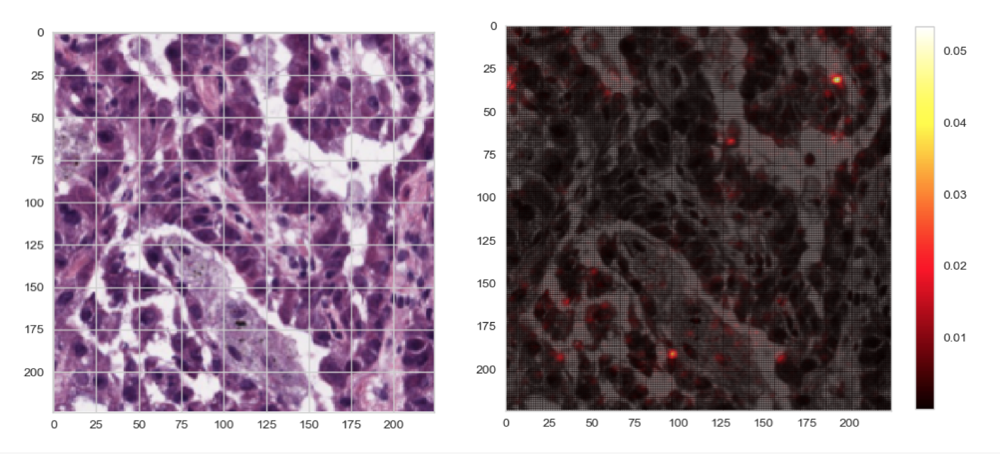
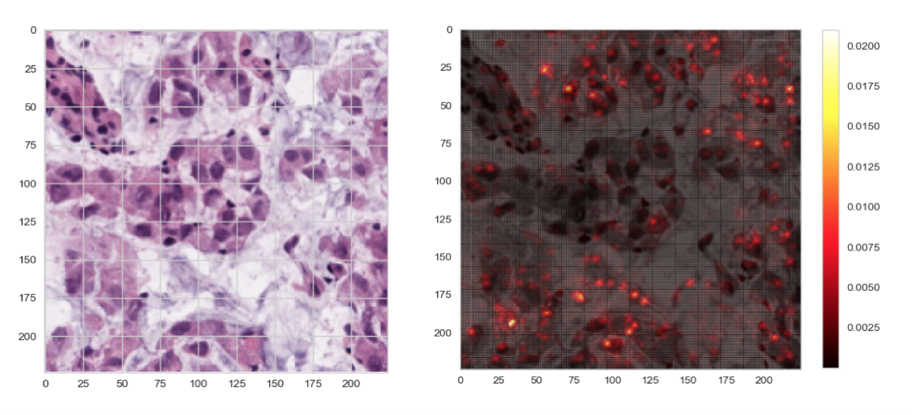
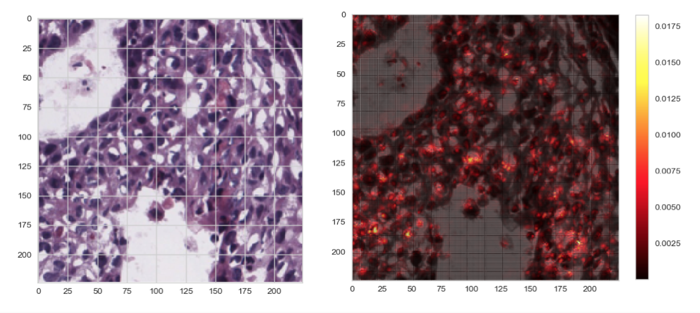
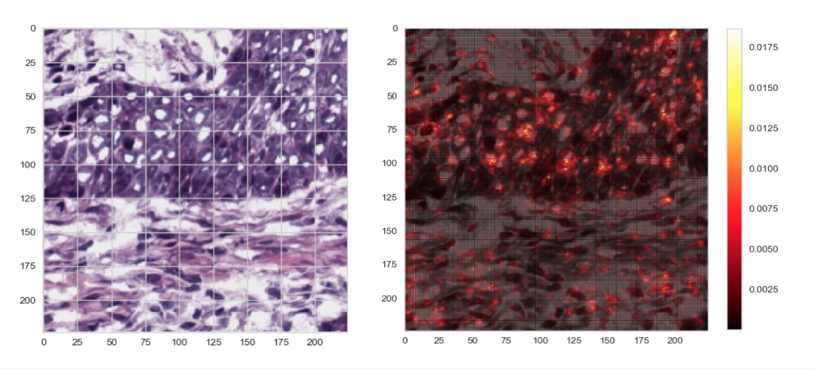

# Convolutional Visual Recognition on Pathology

We provide the approach to make cancer predictions based on pathology data, with the tracing back of the salient region within each image.

## Model Performance
Following are the performances of this task.

| Data | Model | Test Accuracy |
|:--------:|:---------:|:----------:|
|pathology | ResNet18 | **80.47%** |
|pathology | ResNet152 | **78.94%** |

In the task of recognizing LUAD and LUSC cancer signals from the normal pathology data, the best accuracy of the multi-label classification on the test set is 80.47%.

## Saliency Visualization

Saliency experiments for extracting the most salient features that show visually the influence of each region on the classification. Overlays are applied on top of the testing image maps.

Below are the saliency visualizations on test data sample with guided backpropagation from Resnet18 model.  

*LUAD test sample_1 - cropped from original, saliency of guided backpropagation*

*LUAD test sample_2 - cropped from original, saliency of guided backpropagation*

*LUSC test sample_1 - cropped from original, saliency of guided backpropagation*

*LUSC test sample_2 - cropped from original, saliency of guided backpropagation*
