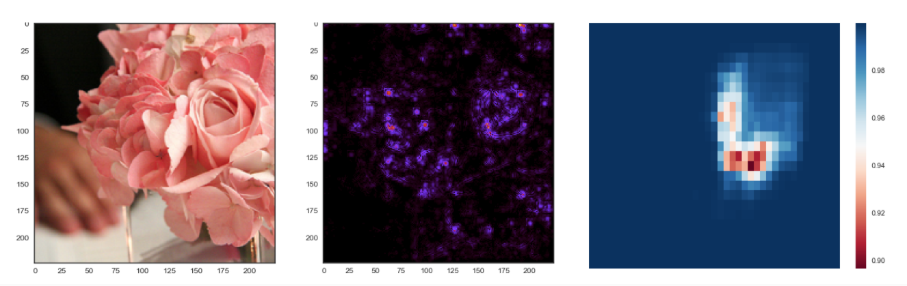

# Deep Vision Mask

This is a **PyTorch** experiment on Deep Visual Recognition Masking with two methods:   
    1) ***Visual Occlusion***, implemented based on [Visualizing and Understanding Convolutional Networks](https://arxiv.org/abs/1311.2901) by *Matthew D Zeiler and Rob Fergus*;   
    2) ***Visual Saliency***, implemented based on [Striving for Simplicity: The All Convolutional Net](https://arxiv.org/abs/1412.6806) by *Jost Tobias Springenberg, Alexey Dosovitskiy, Thomas Brox, and Martin Riedmiller*.

Credits -   
[MarkoArsenovic](https://github.com/MarkoArsenovic/DeepLearning_PlantDiseases), [Deep Visual Recognition (cs231n)](http://cs231n.github.io/transfer-learning/), [PyTorch.org](http://pytorch.org/tutorials/beginner/transfer_learning_tutorial.html) and [PyTorch Git](https://github.com/pytorch/examples/tree/master/imagenet).

## Requirements
- python 3.5+
- pytorch 0.3+
- tensorboard_logger

## Usage
1. Download dataset (eg. [flower](http://www.robots.ox.ac.uk/~vgg/data/flowers/17/index.html) ) and process the data with **data_struct_\*.py**;
2. Run the model with **model.py** `[options]`;  
Alternatively, to train model with Tensorboard, use **model_tensorboard.py** `[options]`;  
3. Visualize Occlusion Experiments with **occlusion.py** `[options]`;  
4. Visualize Saliency Experiment with **saliency.py** `[options]`.

## Results
We have tested our model on various of datasets: 1) a 5-classes subset of the flower dataset; 2) brain scan images; 3) pathology dataset. Following are some of the performance results.

| Data | Model | Batch size | Validation Accuracy |
|:--------:|:---------:|:----------:|:----------:|
flower_5 | ResNet18 | 10 | 90.35%
flower_5 | ResNet18 | 20 | **95.92%**
brain_T1 | ResNet18 | 10 | 78.4%  
brain_T1_FL | ResNet18 | 10 | 57.72%  
brain_T1_GD | ResNet18 | 10 | 81.66%
brain_T2 | ResNet18 | 10 | 65.88%
brain_T2_FL | ResNet18 | 10 | 65.66%
brain_MIX | ResNet18 | 10 | **71.14%**  

**NB:**  
For flower_5 dataset, the best model reaches accuracy 95.92%.  
For brain CT dataset, the best performance is 81.66% on T1_GD modality, and 71.14% for ensemble.  

## Masking Experiments
* Occlusion experiments for producing the heat maps that show visually the influence of each region on the classification. Note that this task does not require image datasets to have bounding boxes or object segmentations.

* Saliency experiments for extracting the most salient features that show visually the influence of each region on the classification. Note that this task does not require image datasets to have bounding boxes or object segmentations.

### Visualization Examples on Resnet18

*roses - original, Saliency of guided backpropagation, Occlusion of size 20 stride 10*

*daisy - original, Saliency of guided backpropagation, Occlusion of size 20 stride 10*
