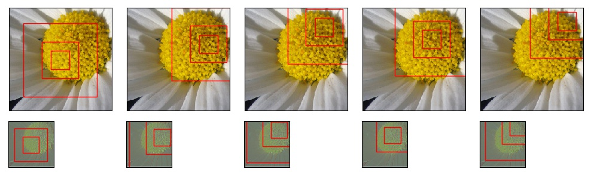
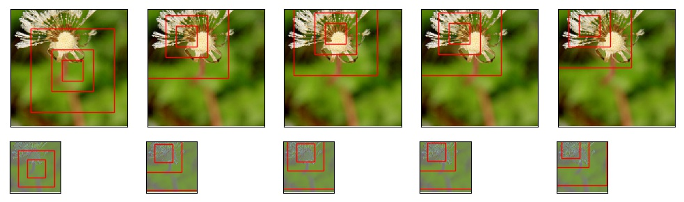
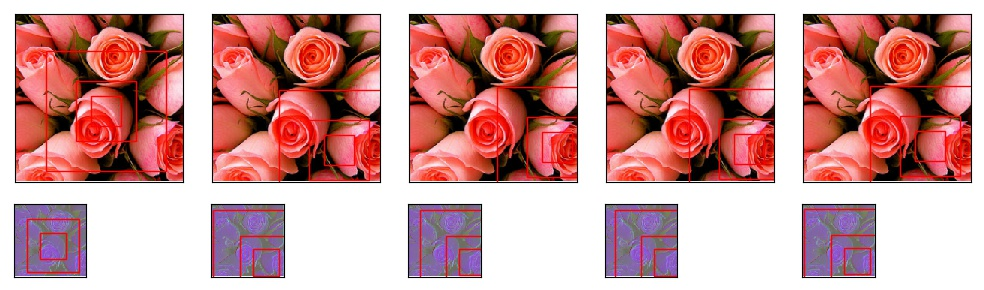

# Recurrent Visual Attention

This is a **PyTorch** implementation of [Recurrent Models of Visual Attention](https://arxiv.org/abs/1406.6247) by *Volodymyr Mnih, Nicolas Heess, Alex Graves and Koray Kavukcuoglu*. 

Folked from [kevinzakka](https://github.com/kevinzakka/recurrent-visual-attention). The original ```readme``` file is [here](original_README.md).

## Requirements

- python 3.5+
- pytorch 0.3+
- tensorboard_logger

## Modifications

* Generalized to other datasets (gray-scale and RGB)
* Input images do not need to be square
* Fixed some bugs, like tensor shape of image arrays in a minibatch
* Added data augmentation
* Proposed stacked RAM model, which adds convolutional layers

## Usage

1. Download [flower](http://www.robots.ox.ac.uk/~vgg/data/flowers/17/index.html) dataset

2. Run the following command to process data  
```Python
python dataset2.py [raw_data_dir] [dst_dir] [valid_ratio]
```
3. Train the model  
```Python
python main.py [options]
```

4. Visualize
```Python
python viz.py [options]
```
Note, in this step, you must set ```patch_size```, ```num_patches``` and ```num_glimpses``` etc. to the same values as in the best model.

## Results

We have tried the subset of the flower dataset, which has 5 classes. Following are the hyperparamters we used for flower dataset. Others are set as default.

* Global convolutional stacked RAM: the best model reaches accuracy 69.4%.

| #patches | #glimpses | patch size | kernel size|
|:--------:|:---------:|:----------:|:----------:|
3 | 4 | 40 | 3 0

* Pure RNN stacked RAM: the accuracy reaches 71.33%.

| #patches | #glimpses | patch size | #stacks|
|:--------:|:---------:|:----------:|:----------:|
3 | 6 | 10 | 3

## Visualization

* Global convolutional stacked RAM

We visualize the locations and patches the model attends, the first row represents the raw image while the second one is the image after convolution and pooling layers. Red rectangles are the patches with different sizes and co-centered.

<p align="center">

</p>

<p align="center">

</p>

<p align="center">

</p>

* Pure RNN stacked RAM

Each row represents the image with different resolution, or at different distances. 

<p align="center">

</p>

<p align="center">

</p>

<p align="center">

</p>
