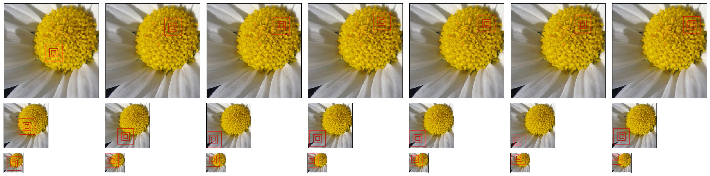

# Recurrent Visual Attention

This is a **PyTorch** implementation of [Recurrent Models of Visual Attention](https://arxiv.org/abs/1406.6247) by *Volodymyr Mnih, Nicolas Heess, Alex Graves and Koray Kavukcuoglu*. 

Folked from [kevinzakka](https://github.com/kevinzakka/recurrent-visual-attention). The original ```readme``` file is [here](original_README.md).

## Requirements

- python 3.5+
- pytorch 0.3+
- tensorboard_logger

## Modifications

* Generalized to other datasets (gray-scale and RGB)
* Input images do not need to be square
* Fixed some bugs, like tensor shape of image arrays in a minibatch

## Usage

1. Download [flower](http://www.robots.ox.ac.uk/~vgg/data/flowers/17/index.html) dataset

2. Run the following command to process data  
```Python
python dataset.py [raw_data_dir] [dst_dir] [size]
```
In our experiment, ```size=200```, i.e. we resize each image to 200 x 200.

3. Train the model  
```Python
python main.py [options]
```

4. Visualize
```Python
python viz.py [options]
```
Note, in this step, you must set ```patch_size```, ```num_patches``` and ```num_glimpses``` to the values of the best model.

## Results

We list the hyperparameters and their performances.

|  | #patches | #glimpses | patch size | accuracy |
|:--:|:--------:|:---------:|:----------:|:--------:|
1 | 2 | 4 | 10 | 51.5
2 | 2 | 4 | 15 | 52.9
3 | 2 | 4 | 20 | 53.7
4 | 2 | 6 | 10 | 52.9
5 | 2 | 6 | 15 | 55.1
6 | 2 | 6 | 20 | 44.1
7 | 2 | 8 | 10 | 57.4
8 | 2 | 8 | 15 | 39.0
9 | 2 | 8 | 20 | 42.6
10 | 3 | 4 | 10 | 50.0
11 | 3 | 4 | 15 | 55.1
12 | 3 | 4 | 20 | 58.1
13 | 3 | 6 | 10 | 52.2
14 | 3 | 6 | 15 | 52.9
15 | 3 | 6 | 20 | 35.0
16 | 3 | 8 | 10 | 52.2
17 | 3 | 8 | 15 | 57.4
18 | 3 | 8 | 20 | 54.4

## Visualization

We select Model **17** as an example to visualize the location the model attends. As a result, the model pays attention to the upper left region of the image.

<p align="center">

</p>
<p align="center">

</p>
<p align="center">

</p>
<p align="center">

</p>
<p align="center">

</p>
<p align="center">

</p>

