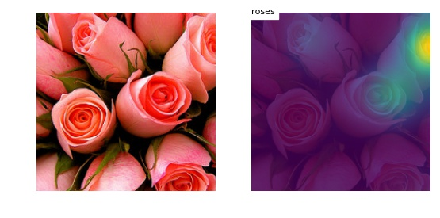
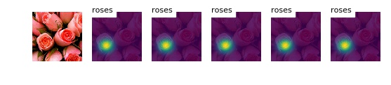
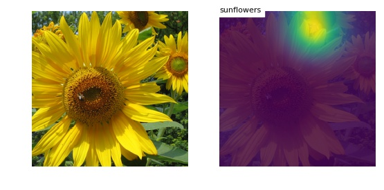
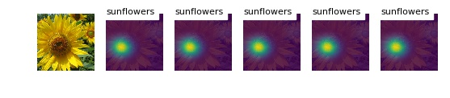
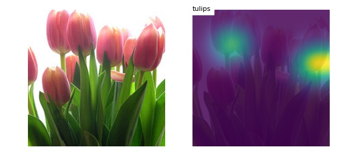
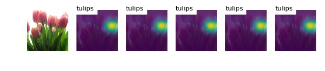

# Show Attend and Tell for Classification

This is a PyTorch implementation of [Show Attend and Tell](https://arxiv.org/abs/1502.03044) for image classification task, with soft attention mechanism.

## Requirements

* Python 3.6
* PyTorch 0.3
* MatPlotLib
* NumPy
* scikit-learn
* scikit-image

## Usage

1. We use the same dataset as descibed in [deep-visual-masking](/deep-visual-masking) and [recurrent-visual-attention](/recurrent-visual-attention). However, for our [flower](http://www.robots.ox.ac.uk/~vgg/data/flowers/17/index.html) dataset, we select five classes -- daisy, dandelion, rose, sunflower and tulip.

2. [Optional] Feel free to change the parameters in the file [config.py](./config.py).

3. Train the model: type ```python main.py <data_dir> <ckpt_dir> train```.

4. [Optional] Evaluate a trained model: type ```python main.py <data_dir> <ckpt_dir> eval```.

5. Visualize attention: type ```python viz.py <data_dir> <ckpt_dir>```.

## Model

* We use [VGG net](https://arxiv.org/abs/1409.1556) to encode the image (the last two layers -- ReLU and max pooling -- are discarded, same in the original [Show Attend and Tell](https://arxiv.org/abs/1502.03044) paper). Thus we get features with size 196 x 512.

* The decoder is a single-layer GRU with soft attention mechanism.

## Result

The table below reports the accuracy of flower dataset with different numbers of repeats after 50 training epochs. We also test the experiments without fine-tuning the VGG net. In one word, fine-tuning benefits. And it is really not necessary to repeat labels multiple times.

| #repeats | accuracy(train/valid)	| AUC |
|:--------:|:---------:|:----------:|
| 1 | **97.61/96.33** |	0.9931 |
| 3 | 97.03/95.79	| 0.9939 |
| 5 | 97.68/96.06	| 0.9945 |
| 7 | 95.43/95.92	| 0.9906 |
| 9 | 96.63/95.92 |	0.9954 |

## Visualization

We visualize the result with repeat number 1 and 5. As we can see, the model always attends to the same region, which corroborates repetition plays little role.

<p align="center">

</p>

<p align="center">

</p>

<p align="center">

</p>

<p align="center">

</p>

<p align="center">

</p>

<p align="center">

</p>
